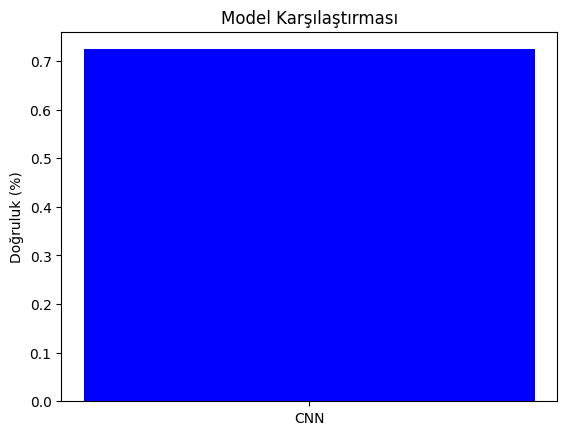

# Hayvan Görselleri Sınıflandırma Projesi

Bu proje, farklı hayvan türlerini sınıflandırmak için derin öğrenme teknikleri kullanarak bir **Convolutional Neural Network (CNN)** modeli geliştirmeyi amaçlamaktadır. Proje kapsamında, hayvan görselleri üzerinde veri artırma (augmentation) ve renk sabitliği gibi yöntemler uygulanarak model performansı değerlendirilmiştir. Model, **PyTorch** kütüphanesi ile geliştirilmiştir.

## Projenin Amacı

Bu projenin amacı, belirli hayvan sınıflarını sınıflandırabilecek bir yapay zeka modeli oluşturmaktır. Proje ayrıca manipüle edilmiş ve renk sabitliği uygulanmış görseller üzerinde modelin nasıl performans gösterdiğini incelemeyi hedeflemektedir.

## Kullanılan Teknolojiler

- **Python**
- **PyTorch**
- **OpenCV**
- **Matplotlib**
- **Scikit-learn**

## Veri Kümesi

Proje, [Animals with Attributes 2 (AWA2)](https://cvml.ist.ac.at/AwA2/) veri kümesini kullanmaktadır. Aşağıdaki hayvan sınıfları çalışmada kullanılmıştır:

- **Collie**
- **Dolphin**
- **Elephant**
- **Fox**
- **Moose**
- **Rabbit**
- **Sheep**
- **Squirrel**
- **Giant Panda**
- **Polar Bear**

## Özellikler

- **Veri Seçimi ve Hazırlığı:**
  - 10 farklı hayvan sınıfından görseller seçilerek bir çalışma dizini oluşturulmuştur.
  - Görseller 64x64 çözünürlüğe yeniden boyutlandırılmıştır.
- **Veri Artırma (Augmentation):**
  - Görsellere rastgele yatay çevirme, döndürme, bulanıklaştırma ve parlaklık ayarları uygulanmıştır.
- **CNN Modeli:**
  - 3 konvolüsyon katmanı (Conv2D) ve 2 tam bağlantılı (fully connected) katman içerir.
  - Dropout tekniği ile aşırı öğrenme (overfitting) önlenmiştir.
- **Performans Ölçümleri:**
  - Modelin doğruluğu, manipüle edilmiş görüntüler ve renk sabitliği uygulanmış görüntüler üzerinde test edilmiştir.
 
## Anahtar İşlevler

### Veri Hazırlama ve Yükleme
**Kodda Yapılanlar:**
- Belirlenen 10 hayvan sınıfından toplam 650 görsel seçildi.
- Görseller, 64x64 boyutuna ölçeklendirildi.
- Eğitim ve test veri setleri için **train_test_split** kullanılarak veri ayrımı yapıldı.
- Veri artırma işlemleri (yatay çevirme, döndürme, parlaklık değişimi vb.) uygulanarak veri çeşitliliği artırıldı.

### CustomDataset Sınıfı
**Kodda Yapılanlar:**
- Özel bir veri kümesi sınıfı oluşturularak, veri yükleme işlemi optimize edildi.
- Görseller, PyTorch'un veri yükleyicisiyle uyumlu hale getirildi.
- Etiketlerle görseller eşleştirildi.

### CNN Modeli
**Kodda Yapılanlar:**
- 3 konvolüsyon katmanı (Conv2D), her birinin ardından bir max-pooling katmanı uygulandı.
- Fully connected (tam bağlantılı) katmanlarla sınıflandırma yapıldı.
- **Dropout** yöntemi ile aşırı öğrenmenin önüne geçildi.

### Eğitim (Training)
**Kodda Yapılanlar:**
- Eğitim sürecinde **Adam optimizer** kullanıldı.
- **CrossEntropyLoss** ile kayıp hesaplamaları yapıldı.
- Her epoch sonunda toplam kayıp raporlandı.

### Modelin Test Edilmesi
**Kodda Yapılanlar:**
- Test veri seti üzerinde model doğruluğu ve sınıflandırma raporu hesaplandı.
- Doğru tahmin edilen sınıflar ve genel model başarımı belirlendi.

### Manipüle Edilmiş Görseller
**Kodda Yapılanlar:**
- Görseller üzerinde rastgele döndürme, çevirme, bulanıklaştırma gibi manipülasyonlar yapıldı.
- Manipüle edilmiş görseller ayrı bir klasöre kaydedildi.

### Renk Sabitliği (Gray World)
**Kodda Yapılanlar:**
- Görsellere renk sabitliği (White Balance) uygulandı.
- Renk tonları düzeltilen görseller, yeni bir veri seti olarak değerlendirildi.

### Performans Değerlendirmesi
**Kodda Yapılanlar:**
- Eğitim ve test veri setleri için doğruluk skorları hesaplandı.
- Manipüle edilmiş ve renk sabitliği uygulanmış görseller üzerinde doğruluk karşılaştırması yapıldı.

## Sonuçlar

1. **Model Doğruluğu:**
   - CNN modeli: **%72.38** doğruluk.
2. **Manipüle Görseller:**
   - Manipüle edilmiş veri doğruluğu: **%25.00**.
3. **Renk Sabitliği:**
   - Renk sabitliği uygulanmış veri doğruluğu: **%34.85**.

## Görseller

Model performansı aşağıdaki grafikte gösterilmektedir:

